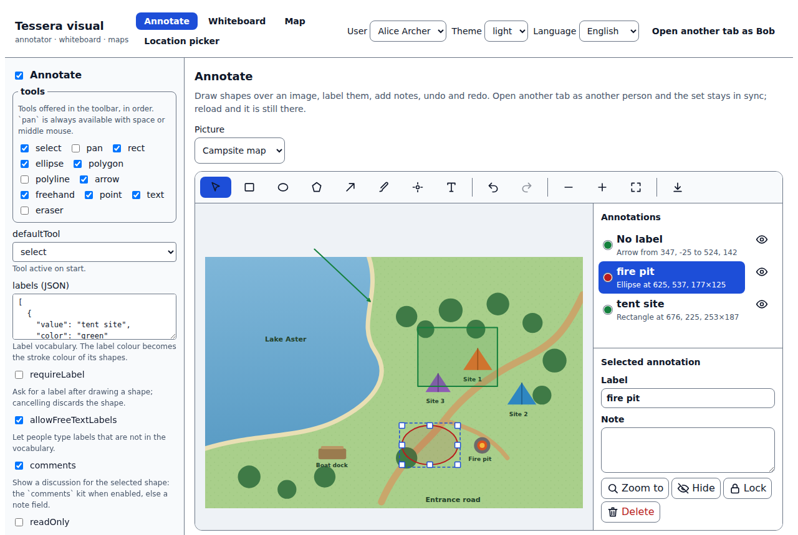
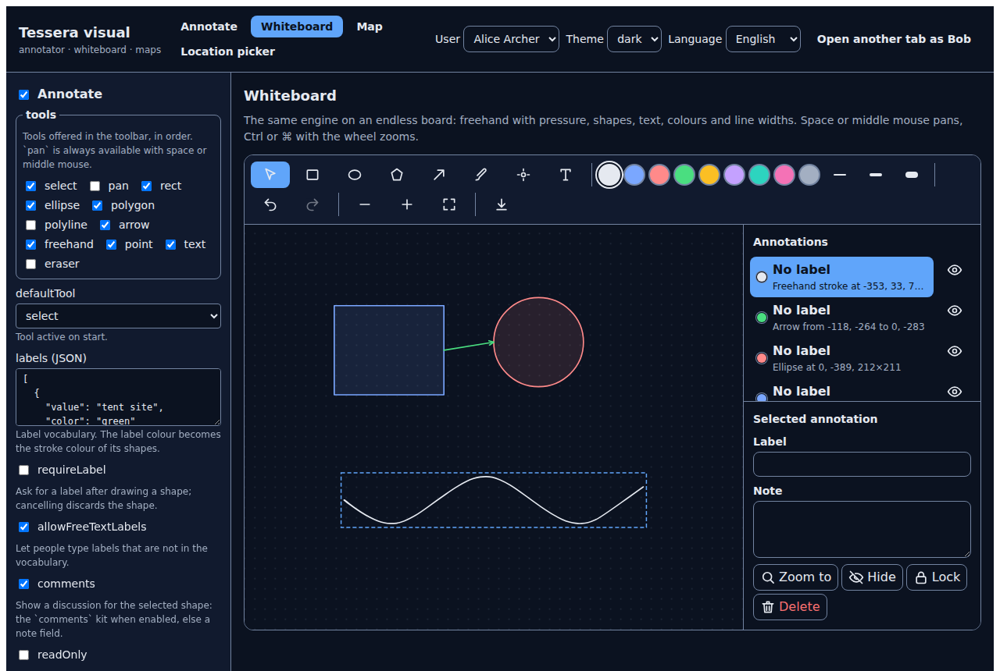
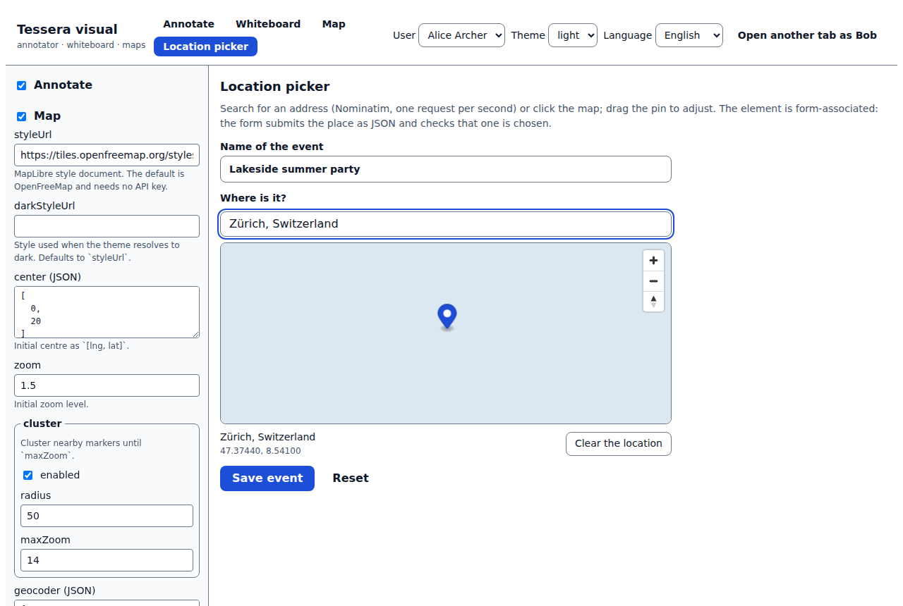

<h1 align="center">tessera-visual</h1>

<p align="center"><b>Spatial pieces for any web app: image annotation and a whiteboard, and maps with clustering and location picking, with no API keys required.</b> Part of the <a href="https://github.com/thakurabhishek7283/tessera">Tessera</a> kit family: switch a feature on with configuration, use it in any framework, keep the data in the browser or in your own backend.</p>

<p align="center">
  <a href="https://github.com/thakurabhishek7283/tessera-visual/actions/workflows/ci.yml"></a>
  <a href="LICENSE"></a>
  · <a href="https://thakurabhishek7283.github.io/tessera-visual/">Live demo</a>
</p>

<p align="center"></p>

## Why

Marking up a picture and putting places on a map keep coming back in products (a site plan to annotate, a gear photo to point at, a booking form that needs an address), and each time they arrive with a heavy library, an API key and a pile of framework glue. These kits sit on the small Tessera core instead: sets of shapes are stored through a *storage adapter*, so the same code runs in one browser (which is how the live demo works, with nothing to host), against the reference server, or against your own backend. A feature you do not enable never loads its code, MapLibre is fetched only when a map opens, and every UI piece is a web component, so it works in React, Angular, Vue or plain HTML.

## Packages

| Package | What it gives you | More |
| --- | --- | --- |
| [`@tessera-kit/annotator`](packages/annotator) | `<tessera-annotator>` for images and `<tessera-whiteboard>` for an endless board: rectangles, ellipses, polygons, lines, arrows, freehand with pen pressure, points and text; labels, notes, snapping, undo and redo, rotation, W3C Web Annotation import and export, PNG export, an accessible list of all shapes | [README](packages/annotator/README.md) |
| [`@tessera-kit/maps`](packages/maps) | `<tessera-map>` with clustered markers and popups from a template, `<tessera-location-picker>` (form-associated: address search, click or drag a pin, submits JSON), a rate-limited Nominatim and MapTiler geocoder, light and dark styles | [README](packages/maps/README.md) |

Both have a headless API and a `/react` entry.

<table>
  <tr>
    <td></td>
    <td></td>
  </tr>
</table>

<sub>The map screenshots use a blank style because they were taken without a network; the live demo shows OpenFreeMap tiles.</sub>

## Quick start

The packages are not on npm yet, so build them from source first (see [Development](#development)). The snippets show the code you will write once they are installed.

### Any framework (Web Components)

```html
<script type="module">
  import '@tessera-kit/annotator/elements';
  import '@tessera-kit/maps/elements';
</script>

<tessera-annotator src="/camp-map.jpg" set-id="camp-map"></tessera-annotator>
<tessera-whiteboard board-id="standup"></tessera-whiteboard>
<tessera-map fit-markers label="Campsites"></tessera-map>
<form><tessera-location-picker name="venue" required></tessera-location-picker></form>
```

A bare element runs on Tessera's implicit default instance, which stores in the browser and turns its own feature on with the defaults. Draw a shape, reload the page, and it is still there; open a second tab and it appears there too.

### React

```tsx
import { Annotator } from '@tessera-kit/annotator/react';
import { LocationPicker, MapView } from '@tessera-kit/maps/react';

export function Site({ markers }: { markers: Array<{ id: string; lng: number; lat: number }> }) {
  return (
    <>
      <Annotator src="/camp-map.jpg" setId="camp-map" config={{ requireLabel: true }} />
      <MapView markers={markers} fitMarkers />
      <form>
        <LocationPicker name="venue" required />
      </form>
    </>
  );
}
```

The wrappers do nothing on the server, so they are safe in Next.js; import them with `dynamic(() => import(...), { ssr: false })` if you want to avoid the empty tag in the HTML.

### With other Tessera kits

Turn kits on and off in one place; each loads only when enabled.

```ts
import { createTessera } from '@tessera-kit/core';
import { createStorage } from '@tessera-kit/storage';

const tessera = createTessera(
  {
    appId: 'camp',
    storage: { type: 'indexeddb' }, // or { type: 'rest', baseUrl: 'https://…' } for tessera-server
    features: {
      annotator: { enabled: true, labels: [{ value: 'tent site', color: 'green' }] },
      maps: { enabled: true },
      comments: { enabled: true }, // from tessera-realtime: the annotator then discusses each shape
    },
  },
  {
    plugins: {
      annotator: () => import('@tessera-kit/annotator'),
      maps: () => import('@tessera-kit/maps'),
      comments: () => import('@tessera-kit/comments'),
    },
    adapters: { storage: createStorage },
  },
);
```

## Configuration

Every option has a default; `{ enabled: true }` is a valid configuration. The tables are generated from the schemas, so they cannot drift:

- [`annotator` options](packages/annotator/README.md#configuration): `tools`, `labels`, `requireLabel`, `readOnly`, `snapping`, `freehand`, `persistence`, `minimap`…
- [`maps` options](packages/maps/README.md#configuration): `styleUrl`, `darkStyleUrl`, `center`, `zoom`, `cluster`, `geocoder`, `controls`…

## Events and API

Elements fire kebab-case `CustomEvent`s that bubble and are composed (`annotation-create`, `selection-change`, `marker-click`, `bounds-change`, `location-change`…); the tables are in the [annotator](packages/annotator/README.md#elements) and [maps](packages/maps/README.md#elements) READMEs, next to the headless handles (`AnnotatorHandle`, `MapHandle`) and the keyboard map.

## Architecture

```
 <tessera-annotator> · <tessera-whiteboard> · <tessera-map> · <tessera-location-picker>     ← Lit elements
        │                                                           │
  AnnotatorHandle ── engine (store · history · index · tools)   MapHandle ── MapLibre (lazy)
        │                       │                                   │
   storage adapter     SVG renderer + pointer input          Geocoder (queue + cache)
 (indexeddb · local · rest)
```

The annotator engine has no DOM: shapes, selection, viewport, undo and the tools are plain TypeScript driven by normalized pointer events, so every tool is tested with scripted gestures. A renderer paints it into one SVG, and panning or zooming only changes a `transform`. See [docs/architecture.md](docs/architecture.md) and the [decision records](docs/decisions).

## Development

```sh
nvm use            # Node 22
corepack enable    # pnpm 10 from the packageManager field
pnpm deps          # clones + builds tessera into external/ (or links ../tessera if you have it)
pnpm install
pnpm dev           # playground at http://localhost:5173
pnpm check         # lint, typecheck, unit tests, build
pnpm budget        # page budgets, every dependency included (after a build)
pnpm test:browser  # component tests in Chromium, including real MapLibre (WebGL, no network)
pnpm e2e           # playground end to end (tests tagged @network need NETWORK_E2E=1)
```

Chromium comes from `npx playwright install --with-deps chromium`, or set `CHROMIUM_PATH`.

## Roadmap

- [x] Annotator: eleven tools, snapping, labels, notes, undo and redo, rotation, minimap, W3C import and export, PNG export, persistence with merge, accessible list
- [x] Whiteboard: endless board with grid, colours and line widths
- [x] Maps: lazy MapLibre, clustering, popups, theme styles, geocoder with rate limit, form-associated picker
- [x] React bindings, English and German, light and dark
- [ ] `@tessera-kit/annotator-osd`: deep-zoom images through OpenSeadragon
- [ ] `<tessera-static-map>`: a lightweight preview without MapLibre for list cards
- [ ] Rich text in annotation notes (works today through the `comments` and `editor` kits)
- [ ] Publish to npm

## Licence

MIT © Abhishek Thakur
